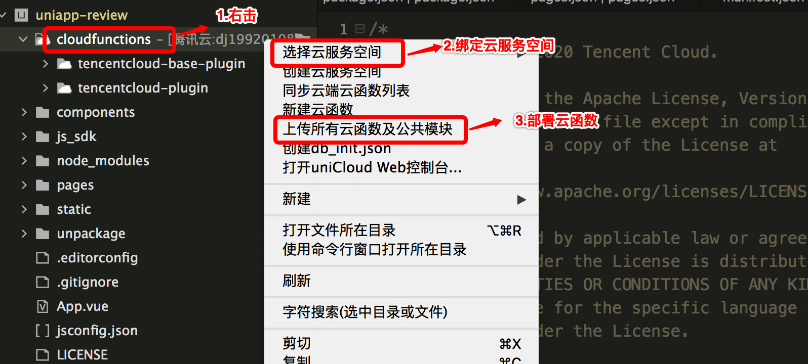

# 腾讯云图像分析（TIIA）插件

## 1. 插件介绍

| 标题        | 名称                                                                                                        |
| ----------- | ----------------------------------------------------------------------------------------------------------- |
| 中文名称    | 腾讯云图像分析（TIIA）插件                                                                                  |
| 英文名称    | tencentcloud-plugin-tiia                                                                                     |
| 最新版本    | v1.0.0 (2020.08.10)                                                                                         |
| 适用平台    | [DCloud uni-app](https://uniapp.dcloud.net.cn)                                                              |
| 适用产品    | [腾讯云图像分析（TIIA）](https://cloud.tencent.com/product/tiia)                                            |
| GitHub 项目 | [tencentcloud-uniapp-plugin-tiia](https://github.com/Tencent-Cloud-Plugins/tencentcloud-uniapp-plugin-tiia) |
| 主创团队    | 腾讯云中小企业产品中心（SMB Product Center of Tencent Cloud）                                               |

一款帮助开发者在 uni-app 项目开发中快捷使用腾讯云图像分析（TIIA）产品功能的插件。

## 2. 功能特性

- 图像理解（解析图像中的场景、物品、人物、动物等）
- 图像处理（对图像进行裁剪、美化）
- 图像审核（恶心检测、不良行为识别等）
- 图像质量评估（分析图像视觉质量）等

## 3. 安装指引

本插件需要调用 uniCloud 云函数，而使用云函数的前提是：

- 使用 DCloud 官方开发工具 HBuilderX 2.7+；
- 已注册 DCloud 开发者账号并通过实名认证；
- 开通了 uniCloud 并创建一个腾讯云的服务空间；

### 3.1. 新建或打开已有项目

1. 打开 HBuilderX 开发工具；
1. 新建或打开一个 uni-app 项目；

### 3.2. 导入云函数

1. 访问 DCloud 插件市场的 [腾讯云插件 - 云函数模板](https://ext.dcloud.net.cn/plugin?id=2139) 详情页；
2. 点击详情页右上角 **使用 HBuilderX 导入插件**，将云函数模板导入到您的项目中；

3. 在项目中打开 _cloudfunctions/tencentcloud-plugin/config.js_ 文件，将腾讯云的密钥信息配置进去，可以在腾讯云 [API 密钥管理](https://console.cloud.tencent.com/cam/capi) 中获取 SecretId、SecretKey 和 APPID；

4. 在[uniCloud控制台](https://unicloud.dcloud.net.cn/login)注册HBuild账号并登录，创建[云服务空间](https://uniapp.dcloud.net.cn/uniCloud/concepts/space)；

5. 绑定云函数的云服务空间，将[云函数](https://uniapp.dcloud.net.cn/uniCloud/concepts/cloudfunction) [**上传部署**](https://uniapp.dcloud.net.cn/uniCloud/quickstart?id=rundebug) 到您的[云服务空间](https://uniapp.dcloud.net.cn/uniCloud/concepts/space)；


> 如果您之前在使用其它腾讯云产品的 uni-app 插件时已经导入过此云函数模板，则前 4 个步骤可以省略。

> 若导入失败或有其它疑问，请查看 [uniCloud 帮助文档](https://uniapp.dcloud.io/uniCloud/README) 云函数相关章节。

### 3.3. 导入插件

1. 访问 DCloud 插件市场 [腾讯云图像分析（TIIA）插件](https://ext.dcloud.net.cn/plugin?id=2520) 详情页；
1. 点击详情页右上角 **使用 HBuilderX 导入插件** ，将插件导入到您的项目中；
1. 在项目中通过 import 语法将插件提供的方法导入到相关业务组件并使用；

> 本插件的默认导入位置是在您项目的“js_sdk”目录下

## 4. 使用指引

### 4.1. 插件 API 导图


### 4.2. 插件API列表

|  API名称   | API对应方法名  |
|  ----  | ----  |
|  **图像理解**  | ----  |
|  图像标签  | detectLabel  |
|  公众人物  | detectCelebrity  |
|  商品识别  | detectProduct  |
|  车辆识别  | recognizeCar  |
|  **图像处理**  | ----  |
|  智能裁剪  | cropImage  |
|  图像清晰度增强  | enhanceImage  |
|  **图像审核**  | ----  |
|  恶心检测  | detectDisgust  |
|  不良行为识别  | detectMisbehavior  |
|  **图像质量评估**  | ----  |
|  图像质量评估  | assessQuality  |


### 4.3. 插件使用示例

```javascript
// 图像质量评估示例

// 选择图片转换为base64编码
import chooseImage2Base64 from "@/js_sdk/tencentcloud-plugin-tiia/choose-image-2base64.js";
// 图像质量评估API
import { assessQuality } from "@/js_sdk/tencentcloud-plugin-tiia";

export default {
  methods: {
    handleAssessQuality: async function() {
      try {
        const img = await chooseImage2Base64();
        uni.showLoading({
          mask: true,
        });
        // 获取图片质量评估结果
        const { result } = await assessQuality({ imageBase64: img });
      } catch (error) {
        uni.showToast({
          icon: "none",
          title: error.message,
        });
      } finally {
        uni.hideLoading();
      }
    },
  },
}
```

### 4.3. 名词解释

服务空间：一个服务空间对应一整套独立的云开发资源，包括数据库、存储空间、云函数等资源。服务空间之间彼此隔离。更多详情请访问 [uniCloud 开发文档](https://uniapp.dcloud.io/uniCloud/concepts/space)

云函数：云函数是运行在云端的 JavaScript 代码，更多详情请见 [uniCloud 云函数文档](https://uniapp.dcloud.io/uniCloud/cf-functions)

## 5. 获取入口

| 插件入口        | 链接                                                                   |
| --------------- | ---------------------------------------------------------------------- |
| DCloud 插件市场 | [腾讯云图像分析（TIIA）插件](https://ext.dcloud.net.cn/plugin?id=2520) |

## 6. GitHub 版本迭代记录

### 6.1. tencentcloud-uniapp-plugin-vod v1.0.0

- 新增图像理解功能
  - 图像标签
  - 公众人物识别
  - 商品识别
  - 车辆识别
- 新增图像处理功能
  - 智能裁剪
  - 图像清晰度增强
- 新增图像审核功能
  - 恶心检测
  - 不良行为识别
- 新增图像质量评估功能
  - 图像质量评估

## 7. 联系我们

&nbsp;&nbsp;&nbsp;扫码备注“春雨”来联络到我们</br>


